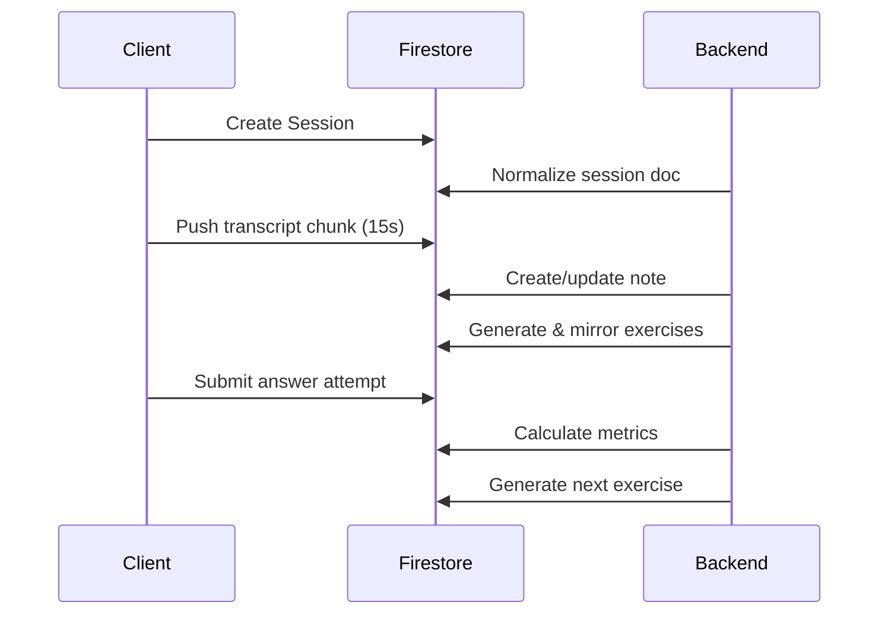

# MindOwl Architecture Documentation

## Table of Contents
1. [Overview](#overview)
2. [Presentation Layer Architecture](#presentation-layer-architecture)
3. [Model Layer Architecture](#model-layer-architecture)
4. [Repository Layer Architecture](#repository-layer-architecture)
5. [Code Generation & Build System](#code-generation--build-system)
6. [Architectural Principles](#architectural-principles)
7. [File Organization Standards](#file-organization-standards)
8. [Use Case Layer Architecture](#use-case-layer-architecture)
9. [Backend Integration Architecture](#backend-integration-architecture)
10. [Best Practices](#best-practices)

## Overview

MindOwl follows a clean architecture approach with a focus on separation of concerns, maintainability, and testability. The architecture is structured into four primary layers:

- **Presentation Layer**: UI components with Riverpod state management
- **Use Case Layer**: Business logic and application flow coordination  
- **Model Layer**: Immutable data models with business logic
- **Repository Layer**: Data access and external service integration

The application also features a sophisticated backend integration system using Firestore triggers for real-time content generation and automatic data synchronization.

## Presentation Layer Architecture

### Atomic Design Structure

Our presentation layer follows atomic design principles to create a scalable and maintainable UI architecture:

```
lib/presentation/screen/[feature]/
├── [feature]_screen.dart          # Main screen (minimal wrapper)
├── organism/
│   └── [feature]_content.dart     # Main orchestration component
├── molecule/
│   ├── component_a.dart           # Reusable UI components
│   ├── component_b.dart
│   └── component_c.dart
└── provider/                      # Optional: screen-specific state
    ├── [feature]_data.dart
    ├── [feature]_provider.dart
    └── generated files...
```

### Component Hierarchy

#### 1. Screen Level (Entry Point)
```dart
// lib/presentation/screen/profile/profile_screen.dart
class ProfileScreen extends StatelessWidget {
  const ProfileScreen({super.key});

  @override
  Widget build(BuildContext context) {
    return const Scaffold(
      body: SafeArea(
        child: ProfileContent(), // Delegates to organism
      ),
    );
  }
}
```

#### 2. Organism Level (Main Logic Container)
```dart
// lib/presentation/screen/profile/organism/profile_content.dart
class ProfileContent extends StatefulWidget {
  const ProfileContent({super.key});

  @override
  State<ProfileContent> createState() => _ProfileContentState();
}

class _ProfileContentState extends State<ProfileContent> {
  // Local state management
  String _userName = 'Alex Chen';
  String _userBio = 'Passionate learner...';

  @override
  Widget build(BuildContext context) {
    return SingleChildScrollView(
      child: Column(
        children: [
          _buildHeader(),
          ProfileHeader(
            userName: _userName,
            userBio: _userBio,
            onNameChanged: _handleNameChange,
            onBioChanged: _handleBioChange,
          ),
          StatsGrid(/* props */),
          AchievementSection(/* props */),
          NotesPreview(/* props */),
        ],
      ),
    );
  }
}
```

#### 3. Molecule Level (Reusable Components)
```dart
// lib/presentation/screen/profile/molecule/profile_header.dart
class ProfileHeader extends StatefulWidget {
  final String userName;
  final String userBio;
  final Function(String) onNameChanged;
  final Function(String) onBioChanged;

  const ProfileHeader({
    super.key,
    required this.userName,
    required this.userBio,
    required this.onNameChanged,
    required this.onBioChanged,
  });

  @override
  State<ProfileHeader> createState() => _ProfileHeaderState();
}

class _ProfileHeaderState extends State<ProfileHeader>
    with TickerProviderStateMixin {
  // Local animation management
  late AnimationController _pulseController;
  late Animation<double> _pulseAnimation;

  @override
  void initState() {
    super.initState();
    _pulseController = AnimationController(
      duration: const Duration(seconds: 2),
      vsync: this,
    )..repeat(reverse: true);
  }

  @override
  Widget build(BuildContext context) {
    return EntranceFader( // Local entrance animation
      child: Container(/* UI implementation */),
    );
  }
}
```

### Animation Management

**Key Principle**: Animations are managed locally within each component, not passed down as props.

```dart
// ✅ CORRECT: Local animation management
class TimerDisplay extends StatefulWidget {
  final int duration;
  
  @override
  State<TimerDisplay> createState() => _TimerDisplayState();
}

class _TimerDisplayState extends State<TimerDisplay>
    with TickerProviderStateMixin {
  late AnimationController _countdownController;
  
  @override
  void initState() {
    super.initState();
    _countdownController = AnimationController(
      duration: Duration(seconds: widget.duration),
      vsync: this,
    );
  }
}

// ❌ WRONG: Don't pass animations as props
class TimerDisplay extends StatelessWidget {
  final Animation<double> animation; // Don't do this
}
```

### State Management with Riverpod

#### Provider Structure
```dart
// lib/presentation/screen/home/provider/home_data.dart
@freezed
sealed class HomeData with _$HomeData {
  const factory HomeData({
    required int currentStreak,
    required int currentLevel,
    required int currentXP,
    required int maxXP,
    required List<Note> recentNotes,
  }) = _HomeData;

  const HomeData._();

  // Computed properties
  double get progressPercentage => currentXP / maxXP;
  int get progressPercent => ((currentXP / maxXP) * 100).toInt();
}
```

```dart
// lib/presentation/screen/home/provider/home_data_provider.dart
@riverpod
class HomeDataProvider extends _$HomeDataProvider {
  @override
  HomeData build() {
    // Initialize with data from repositories
    return HomeData(
      currentStreak: 7,
      currentLevel: 3,
      currentXP: 450,
      maxXP: 600,
      recentNotes: FakeData.notes.take(3).toList(),
    );
  }

  void refreshData() {
    ref.invalidateSelf();
  }
}
```

#### Consumer Usage
```dart
class HomeScreen extends ConsumerWidget {
  @override
  Widget build(BuildContext context, WidgetRef ref) {
    final homeData = ref.watch(homeDataProviderProvider);
    
    return HomeContent(data: homeData);
  }
}
```

## Model Layer Architecture

### Freezed Sealed Classes

All data models use Freezed for immutability, pattern matching, and code generation:

```dart
// lib/model/note.dart
@freezed
sealed class Note with _$Note {
  const factory Note({
    required String id,
    required String title,
    @TimestampDateTimeConverter() required DateTime createdAt,
    @NullableTimestampDateTimeConverter() DateTime? lastReviewed,
    required List<String> topics,
    required String primaryTheme,
    @Default(false) bool isFavorite,
    required String markdownContent,
    @Default(<String>[]) List<String> exoIds,
  }) = _Note;

  factory Note.fromJson(Map<String, dynamic> json) => _$NoteFromJson(json);

  const Note._();

  // Business logic methods
  int get totalExos => exoIds.length;
  
  String get themeColor {
    switch (primaryTheme.toLowerCase()) {
      case 'finance': return '#4CAF50';
      case 'history': return '#9C27B0';
      case 'science': return '#FF9800';
      default: return '#607D8B';
    }
  }
  
  String get formattedCreatedDate {
    final difference = DateTime.now().difference(createdAt).inDays;
    if (difference == 0) return 'Today';
    if (difference == 1) return '1 day ago';
    return '$difference days ago';
  }
}
```

### Custom Converters

Firebase Firestore integration requires custom converters for timestamp handling:

```dart
// lib/model/converters.dart
class TimestampDateTimeConverter implements JsonConverter<DateTime, Object?> {
  const TimestampDateTimeConverter();

  @override
  DateTime fromJson(Object? json) {
    if (json is Timestamp) return json.toDate();
    if (json is String) return DateTime.parse(json);
    throw const FormatException('Invalid date format for DateTime');
  }

  @override
  Object toJson(DateTime date) => Timestamp.fromDate(date);
}
```

### Model Examples

#### User Model
```dart
@freezed
sealed class User with _$User {
  const factory User({
    required String uid,
    @TimestampDateTimeConverter() required DateTime createdDate,
    @Default(false) bool micropermission,
  }) = _User;

  factory User.fromJson(Map<String, dynamic> json) => _$UserFromJson(json);
}
```

#### Session Model
```dart
@freezed
sealed class Session with _$Session {
  const factory Session({
    required String id,
    required String noteId,
    required String source, // 'podcast', 'video', 'audio'
    @TimestampDateTimeConverter() required DateTime startTime,
    @TimestampDateTimeConverter() required DateTime endTime,
    required int duration, // in seconds
    @Default(<String>[]) List<String> exoIds,
  }) = _Session;

  factory Session.fromJson(Map<String, dynamic> json) => _$SessionFromJson(json);

  const Session._();

  String get formattedDuration {
    final minutes = duration ~/ 60;
    final seconds = duration % 60;
    return '${minutes}:${seconds.toString().padLeft(2, '0')}';
  }
}
```

#### Exo (Exercise/Question) Model
```dart
@freezed
sealed class Exo with _$Exo {
  const factory Exo({
    required String id,
    required String noteId,
    required String question,
    required ExoType type,
    required List<String> options,
    required dynamic correctAnswer,
    @Default(false) bool isAnswered,
    @Default(false) bool isCorrect,
    @Default(false) bool isMastered,
    String? userAnswer,
    String? explanation,
  }) = _Exo;

  factory Exo.fromJson(Map<String, dynamic> json) => _$ExoFromJson(json);
}

enum ExoType {
  @JsonValue('multiple_choice')
  multipleChoice,
  @JsonValue('true_false') 
  trueFalse,
  @JsonValue('single_answer')
  singleAnswer,
}
```

## Repository Layer Architecture

### Interface-Based Pattern

All repositories follow an interface-based approach for testability and flexibility:

```dart
// lib/repository/database/user_repository.dart
abstract class IUserRepository {
  Future<User> createUser(User user);
  Future<User?> getUser(String uid);
  Future<void> updateUser(User user);
  Future<void> deleteUser(String uid);
  Future<bool> userExists(String uid);
}

class UserRepository with MyLog implements IUserRepository {
  @override
  Future<User> createUser(User user) async {
    try {
      final docRef = FirebaseFirestore.instance
          .collection('users')
          .doc(user.uid);
      await docRef.set(user.toJson());
      return user;
    } catch (e) {
      throw Exception('Failed to create user: $e');
    }
  }

  @override
  Future<User?> getUser(String uid) async {
    try {
      final docRef = FirebaseFirestore.instance
          .collection('users')
          .doc(uid);
      final doc = await docRef.get();
      
      if (!doc.exists) return null;
      
      return User.fromJson(doc.data()!);
    } catch (e) {
      throw Exception('Failed to get user: $e');
    }
  }
}
```

### Authentication Repository
```dart
// lib/repository/service/auth_repository.dart
abstract class IAuthRepository {
  Future<void> loginUserAnonymously();
  Future<void> signOut();
  String get uid;
  bool get isAuthenticated;
}

class AuthRepository implements IAuthRepository {
  @override
  Future<void> loginUserAnonymously() async {
    try {
      await FirebaseAuth.instance.signInAnonymously();
    } on FirebaseAuthException catch (e) {
      switch (e.code) {
        case 'operation-not-allowed':
          throw Exception('Anonymous authentication is not enabled');
        case 'network-request-failed':
          throw Exception('Network error. Please check your connection');
        default:
          throw Exception('Authentication failed: ${e.message}');
      }
    }
  }

  @override
  String get uid => FirebaseAuth.instance.currentUser?.uid ?? '';

  @override
  bool get isAuthenticated => FirebaseAuth.instance.currentUser != null;
}
```

### Error Handling Strategy

**Important**: We use exception-based error handling, not Either monads.

```dart
// ✅ CORRECT: Exception-based error handling
class UserRepository implements IUserRepository {
  @override
  Future<User> createUser(User user) async {
    try {
      // Firebase operations
      return user;
    } catch (e) {
      throw Exception('Failed to create user: $e');
    }
  }
}

// Use in use cases/providers:
try {
  final user = await userRepository.createUser(newUser);
  // Handle success
} catch (e) {
  // Handle error
  loggy.error('User creation failed: $e');
}

// ❌ WRONG: Don't use Either monads
Future<Either<Failure, User>> createUser(User user) async {
  // We don't use this pattern
}
```

## Code Generation & Build System

### Required Dependencies

```yaml
# pubspec.yaml
dependencies:
  # Architecture
  flutter_riverpod: ^2.6.1
  riverpod_annotation: ^2.6.1
  fpdart: ^1.1.1
  
  # Code generation
  freezed_annotation: ^3.0.4
  json_annotation: ^4.9.0

dev_dependencies:
  # Code generation
  build_runner: ^2.4.15
  riverpod_generator: ^2.6.5
  freezed: ^3.0.4
  json_serializable: ^6.7.1
```

### Code Generation Commands

```bash
# Generate all code (models, providers, etc.)
dart run build_runner build

# Watch for changes and regenerate automatically
dart run build_runner watch

# Clean generated files
dart run build_runner clean
```

### Generated File Patterns

Every Freezed model generates multiple files:
- `model.dart` - Main model definition
- `model.freezed.dart` - Freezed generated code
- `model.g.dart` - JSON serialization code

Every Riverpod provider generates:
- `provider.dart` - Provider definition  
- `provider.g.dart` - Generated provider code

## Architectural Principles

### 1. Separation of Concerns
- **Presentation**: UI components and user interactions with Riverpod state management
- **Use Cases**: Business logic and application flow coordination with Either pattern
- **Models**: Immutable data structures with domain logic using Freezed
- **Repositories**: Data access, external services, and Firestore integration

### 2. Dependency Direction
```
Presentation → Use Cases → Repositories → Models
Presentation → Models (for data structures)
Backend Triggers ← Firestore ← Repositories
```

### 3. Local Animation Management
- Each component manages its own animations
- Don't pass AnimationController or Animation objects as props
- Use TickerProviderStateMixin locally

### 4. Immutable Data
- All models are immutable using Freezed
- State updates create new instances
- No mutable state in models

### 5. Interface Segregation
- Repositories implement abstract interfaces
- Easy to mock for testing
- Clear contracts between layers

## File Organization Standards

```
lib/
├── data/                          # Mock data and constants
├── model/                         # Data models
│   ├── user.dart
│   ├── note.dart
│   ├── session.dart
│   ├── exo.dart
│   ├── converters.dart
│   └── *.freezed.dart, *.g.dart   # Generated files
├── presentation/
│   ├── screen/
│   │   └── [feature]/
│   │       ├── [feature]_screen.dart
│   │       ├── organism/
│   │       │   └── [feature]_content.dart
│   │       ├── molecule/
│   │       │   ├── component_a.dart
│   │       │   └── component_b.dart
│   │       └── provider/           # Optional
│   │           ├── [feature]_data.dart
│   │           ├── [feature]_provider.dart
│   │           └── *.g.dart, *.freezed.dart
│   ├── provider/                  # Global providers
│   │   ├── usecase_provider.dart  # Use case dependency injection
│   │   ├── session_provider.dart  # Session data providers
│   │   ├── note_provider.dart     # Note data providers
│   │   ├── user_provider.dart     # User data providers
│   │   └── *.g.dart              # Generated provider code
│   └── oldscreens/                # Legacy screens (to be refactored)
├── repository/
│   ├── database/
│   │   ├── user_repository.dart
│   │   ├── session_repository.dart
│   │   ├── note_repository.dart
│   │   ├── transcript_repository.dart
│   │   ├── session_exo_repository.dart
│   │   └── attempt_repository.dart
│   ├── service/
│   │   ├── auth_repository.dart
│   │   └── speech_repository.dart
│   └── injection.dart
├── usecases/                      # Business logic layer
│   ├── failure.dart               # Error handling
│   ├── create_session_usecase.dart
│   ├── start_session_usecase.dart
│   ├── pause_session_usecase.dart
│   ├── end_session_usecase.dart
│   ├── push_transcript_chunk_usecase.dart
│   ├── pop_exo_for_session_usecase.dart
│   ├── answer_exo_usecase.dart
│   ├── prepare_quiz_session_usecase.dart
│   ├── advance_quiz_cursor_usecase.dart
│   ├── watch_session_usecase.dart
│   ├── watch_note_usecase.dart
│   └── user_logged_anonymously_usecase.dart
├── utils/                         # Utilities and helpers
└── main.dart
```

## Use Case Layer Architecture

The Use Case layer serves as the business logic coordinator between the Presentation and Repository layers, following clean architecture principles with the Either pattern for error handling.

### Use Case Structure

```dart
// lib/usecases/create_session_usecase.dart
import 'package:fpdart/fpdart.dart';
import 'package:layou_tools/layou_tools.dart';
import 'package:mindowl/model/session.dart';
import 'package:mindowl/repository/injection.dart';
import 'package:mindowl/usecases/failure.dart';
import 'package:mindowl/utils/log.dart';

class CreateSessionUseCase with MyLog {
  CreateSessionUseCase();

  Future<Either<UseCaseFailure, Session>> call({
    required SessionType type,
    String? noteId, // Optional - backend creates note on first chunk
  }) async {
    try {
      final sessionId = generateRandomId();
      final session = Session(
        id: sessionId,
        noteId: noteId ?? '', // Empty noteId - backend will set it
        title: 'Session ${DateTime.now().toIso8601String()}',
        type: type,
        status: SessionStatus.idle,
        createdAt: DateTime.now(),
      );

      final createdSession = await sessionRepo.createSession(
        authRepo.uid,
        session,
      );
      
      loggy.info('Session created: ${createdSession.id}');
      return right(createdSession);
    } catch (e) {
      loggy.error('Failed to create session: $e');
      return left(UseCaseFailure('Failed to create session', e));
    }
  }
}
```

### Error Handling with Either Pattern

Use cases implement the Either pattern from `fpdart` for functional error handling:

```dart
// lib/usecases/failure.dart
class UseCaseFailure {
  final String message;
  final dynamic error;

  const UseCaseFailure(this.message, [this.error]);

  @override
  String toString() => 'UseCaseFailure: $message';
}

// Usage in notifiers:
final result = await createSessionUseCase(
  type: SessionType.listening,
  noteId: noteId,
);

result.fold(
  (failure) => state = state.copyWith(error: failure.message),
  (session) => {
    // Clear any previous errors
    state = state.copyWith(error: null),
    // Handle success
    context.push('/listening', extra: {'sessionId': session.id}),
  },
);
```

### Use Case Provider Pattern

All use cases are provided through Riverpod providers for dependency injection and testability:

```dart
// lib/presentation/provider/usecase_provider.dart
import 'package:riverpod_annotation/riverpod_annotation.dart';
import 'package:mindowl/usecases/create_session_usecase.dart';
// ... other imports

part 'usecase_provider.g.dart';

// Session Management Use Cases
@riverpod
CreateSessionUseCase createSessionUseCase(Ref ref) {
  return CreateSessionUseCase();
}

@riverpod
StartSessionUseCase startSessionUseCase(Ref ref) {
  return StartSessionUseCase();
}

// Usage in notifiers:
class ListeningScreenNotifier extends _$ListeningScreenNotifier {
  Future<void> createSession() async {
    final createSessionUseCase = ref.read(createSessionUseCaseProvider);
    final result = await createSessionUseCase(type: SessionType.listening);
    // Handle result...
  }
}
```

### Use Case Categories

#### Session Management
- `CreateSessionUseCase` - Creates new learning sessions
- `StartSessionUseCase` - Starts idle sessions
- `PauseSessionUseCase` - Pauses running sessions
- `EndSessionUseCase` - Ends active sessions

#### Content Processing  
- `PushTranscriptChunkUseCase` - Sends audio transcripts to backend
- `PopExoForSessionUseCase` - Retrieves generated exercises
- `AnswerExoUseCase` - Submits exercise answers

#### Quiz Management
- `PrepareQuizSessionUseCase` - Sets up quiz sessions
- `AdvanceQuizCursorUseCase` - Moves to next question
- `AnswerExoUseCase` - Handles quiz responses

#### Data Watching
- `WatchSessionUseCase` - Real-time session monitoring
- `WatchNoteUseCase` - Real-time note updates
- `WatchExoAttemptsUseCase` - Real-time attempt tracking

## Backend Integration Architecture

MindOwl features a sophisticated backend integration system using Firestore triggers that automatically handle content generation, data synchronization, and real-time updates.

### Backend Trigger System

The backend operates through 8 main Firestore triggers that handle all heavy lifting:

#### 1. Session Creation (`onSessionCreate`)
```typescript
// Backend trigger: users/{uid}/sessions/{sessionId} — onCreate
// - Normalizes session document (status, type, startedAt)
// - Does not create notes (handled on first chunk)
```

#### 2. Chunk Processing (`onChunkCreate`)  
```typescript
// Backend trigger: users/{uid}/sessions/{sessionId}/chunks/{chunkId} — onCreate
// - Takes chunk.text (pre-transcribed by client)
// - Upserts note: creates if missing, merges if exists
// - Generates exercises for the session
// - Mirrors exercises to both session and note collections
```

#### 3. Note Updates (`onNoteWrite`)
```typescript
// Backend trigger: users/{uid}/notes/{noteId} — onCreate|onUpdate
// - Generates additional exercises when notes evolve during active sessions
// - Maintains activeSessionId for continuous learning flow
```

#### 4. Answer Processing (`onAttemptCreate`)
```typescript
// Backend trigger: **/exos/{exoId}/attempts/{attemptId} — onCreate (collection group)
// - Calculates attempt duration and scoring
// - Generates next exercise for the session
// - Ensures continuous learning flow
```

### Client-Backend Flow



### Real-Time Data Synchronization

The client uses Riverpod providers with Firestore streams for automatic real-time updates:

```dart
// lib/presentation/provider/session_provider.dart
@riverpod
Stream<Session?> sessionStream(Ref ref, String sessionId) {
  return sessionRepo.watchSession(authRepo.uid, sessionId);
}

@riverpod
Session? sessionById(Ref ref, String sessionId) {
  final sessionAsync = ref.watch(sessionStreamProvider(sessionId));
  return sessionAsync.value; // Automatically updates when backend changes
}

// Usage in notifiers - automatically reactive to backend changes:
class ListeningScreenNotifier extends _$ListeningScreenNotifier {
  Session? get currentSession {
    if (state.currentSession == null) return null;
    return ref.watch(sessionByIdProvider(state.currentSession!.id));
    // Automatically reflects backend-generated changes
  }
}
```

### Session State Management

The application implements sophisticated session validation and timer management:

#### Unified Timer System
```dart
class ListeningScreenNotifier extends _$ListeningScreenNotifier {
  Timer? _mainTimer; // Single timer for all operations
  Timer? _debounceTimer; // Text chunk debouncing
  
  void _startUnifiedTimer() {
    _cleanupTimers();
    _mainTimer = Timer.periodic(const Duration(seconds: 1), (timer) {
      final session = currentSession;
      if (session?.status != SessionStatus.running) {
        _cleanupTimers(); // Auto-cleanup on invalid state
        return;
      }

      state = state.copyWith(sessionTimer: state.sessionTimer + 1);

      // Coordinated operations:
      if (state.sessionTimer % 15 == 0) _pushTranscriptChunk(); // Every 15s
      if (state.sessionTimer % 30 == 0) _popExoForSession();     // Every 30s
      if (state.sessionTimer % 15 == 0) _triggerQuestion();      // Every 15s
    });
  }
}
```

#### Session Validation
```dart
// Real-time validation before operations
Future<void> pauseSession() async {
  final session = currentSession; // Get real-time session from provider
  if (session == null || session.status != SessionStatus.running) return;
  
  final result = await pauseSessionUseCase(sessionId: session.id);
  result.fold(
    (failure) => state = state.copyWith(error: failure.message),
    (session) => _cleanupTimers(),
  );
}
```

### Transcript Processing Optimization

Implement debounced transcript processing to prevent backend spam:

```dart
class ListeningScreenNotifier extends _$ListeningScreenNotifier {
  Timer? _debounceTimer;
  String _pendingTextChunk = '';

  void _onTextChunkReceived(String textChunk) {
    // Immediate UI update for responsiveness
    state = state.copyWith(textChunks: [...state.textChunks, textChunk]);

    // Debounced backend processing
    _pendingTextChunk += ' $textChunk';
    _debounceTimer?.cancel();
    _debounceTimer = Timer(const Duration(milliseconds: 500), () {
      state = state.copyWith(latestTextChunk: _pendingTextChunk.trim());
      _pendingTextChunk = '';
    });
  }
}
```

### Provider Architecture Optimization

#### Consistent Naming and Organization
```dart
// All providers follow consistent naming patterns:
@riverpod
Session? sessionById(Ref ref, String sessionId) { /* ... */ }

@riverpod  
Stream<Session?> sessionStream(Ref ref, String sessionId) { /* ... */ }

@riverpod
List<SessionExo> sessionExosById(Ref ref, String sessionId) { /* ... */ }

@riverpod
Stream<List<SessionExo>> sessionExosStream(Ref ref, String sessionId) { /* ... */ }
```

#### Error State Management
```dart
// Consistent error handling across all operations:
result.fold(
  (failure) => state = state.copyWith(error: failure.message),
  (success) => state = state.copyWith(error: null), // Clear on success
);
```

## Best Practices

### BuildContext Handling
```dart
// ✅ CORRECT: Use Builder widget to access context properly
Widget _buildSingleAnswerOption() {
  return Builder(
    builder: (context) {
      return TextField(
        decoration: InputDecoration(
          focusedBorder: OutlineInputBorder(
            borderSide: BorderSide(
              color: Theme.of(context).colorScheme.primary,
            ),
          ),
        ),
      );
    },
  );
}

// ❌ WRONG: Never access context through method calls
Widget _buildSingleAnswerOption() {
  return TextField(
    decoration: InputDecoration(
      focusedBorder: OutlineInputBorder(
        borderSide: BorderSide(
          color: Theme.of(_buildSingleAnswerOption().context!).colorScheme.primary, // NEVER!
        ),
      ),
    ),
  );
}
```

### Naming Conventions
- **Screens**: `[Feature]Screen` (e.g., `ProfileScreen`)
- **Organisms**: `[Feature]Content` (e.g., `ProfileContent`)
- **Molecules**: Descriptive names (e.g., `ProfileHeader`, `StatsGrid`)
- **Models**: Singular nouns (e.g., `User`, `Note`, `Session`)
- **Repositories**: `[Model]Repository` (e.g., `UserRepository`)
- **Providers**: `[Feature]DataProvider` (e.g., `HomeDataProvider`)

### Component Props
- Pass data down, callbacks up
- Keep prop lists focused and minimal
- Use required for essential props
- Provide sensible defaults with `@Default()`

```dart
class ProfileHeader extends StatelessWidget {
  final String userName;           // Required data
  final String userBio;           // Required data  
  final Function(String) onNameChanged; // Callback up
  final Function(String) onBioChanged;  // Callback up
  
  const ProfileHeader({
    super.key,
    required this.userName,
    required this.userBio,
    required this.onNameChanged,
    required this.onBioChanged,
  });
}
```

### Testing Strategy
- Unit tests for models and their business logic
- Widget tests for molecules and organisms
- Integration tests for complete user flows
- Mock repositories using interfaces

### Performance Considerations
- Use `const` constructors where possible
- Implement proper `==` and `hashCode` (Freezed handles this)
- Avoid rebuilds with proper state management
- Use `ListView.builder` for large lists

### Session Management Best Practices

#### Timer Optimization
```dart
// ✅ CORRECT: Unified timer system
class ListeningScreenNotifier extends _$ListeningScreenNotifier {
  Timer? _mainTimer; // Single timer for all operations
  
  void _startUnifiedTimer() {
    _cleanupTimers();
    _mainTimer = Timer.periodic(const Duration(seconds: 1), (timer) {
      // All periodic operations in one timer
      if (state.sessionTimer % 15 == 0) _pushTranscriptChunk();
      if (state.sessionTimer % 30 == 0) _popExoForSession();
    });
  }
}

// ❌ WRONG: Multiple separate timers
class ListeningScreenNotifier extends _$ListeningScreenNotifier {
  Timer? _sessionTimer;
  Timer? _transcriptTimer;  // Avoid multiple timers
  Timer? _exoTimer;         // Resource inefficient
}
```

#### Session State Validation
```dart
// ✅ CORRECT: Real-time validation
Future<void> pauseSession() async {
  final session = currentSession; // Get real-time session from provider
  if (session == null || session.status != SessionStatus.running) return;
  
  final result = await pauseSessionUseCase(sessionId: session.id);
}

// ❌ WRONG: Using stale state
Future<void> pauseSession() async {
  if (state.currentSession == null) return; // Stale state!
  
  final result = await pauseSessionUseCase(sessionId: state.currentSession!.id);
}
```

#### Debounced Operations
```dart
// ✅ CORRECT: Debounce rapid operations
Timer? _debounceTimer;
String _pendingTextChunk = '';

void _onTextChunkReceived(String textChunk) {
  // Immediate UI update
  state = state.copyWith(textChunks: [...state.textChunks, textChunk]);

  // Debounced backend processing
  _pendingTextChunk += ' $textChunk';
  _debounceTimer?.cancel();
  _debounceTimer = Timer(const Duration(milliseconds: 500), () {
    _processChunk(_pendingTextChunk.trim());
    _pendingTextChunk = '';
  });
}
```

### Use Case Architecture Best Practices

#### Provider-Based Dependency Injection
```dart
// ✅ CORRECT: Use providers for use cases
class NotifierExample extends _$NotifierExample {
  Future<void> performAction() async {
    final useCase = ref.read(actionUseCaseProvider);
    final result = await useCase();
  }
}

// ❌ WRONG: Direct instantiation
class NotifierExample extends _$NotifierExample {
  final _useCase = ActionUseCase(); // Memory inefficient
}
```

#### Error Handling Consistency
```dart
// ✅ CORRECT: Consistent Either handling with error clearing
result.fold(
  (failure) => state = state.copyWith(error: failure.message),
  (success) => state = state.copyWith(error: null), // Clear on success
);

// ❌ WRONG: Inconsistent error handling
result.fold(
  (failure) => state = state.copyWith(error: failure.message),
  (success) => {}, // Doesn't clear previous errors
);
```

### Provider Naming Consistency
```dart
// ✅ CORRECT: Consistent naming patterns
@riverpod
Session? sessionById(Ref ref, String sessionId) { }

@riverpod
Stream<Session?> sessionStream(Ref ref, String sessionId) { }

@riverpod
List<SessionExo> sessionExosById(Ref ref, String sessionId) { }

// ❌ WRONG: Inconsistent naming
@riverpod
Session? sessionByIdProvider(Ref ref, String sessionId) { } // Extra "Provider" suffix
```

---

This architecture documentation serves as the definitive guide for MindOwl's codebase structure. All new features should follow these patterns, and legacy code should be gradually refactored to match these standards.